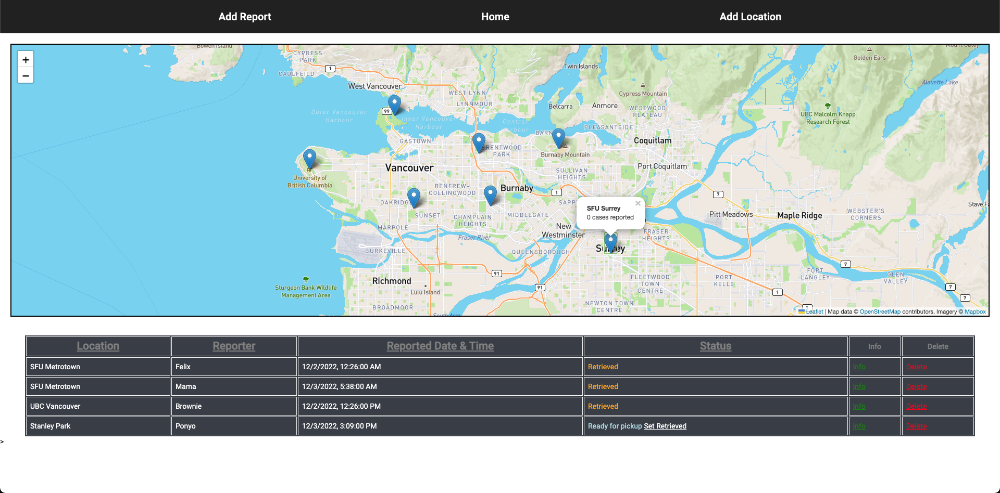

# PigLocator

View website at [pig-locator.brianrahadi.com](https://pig-locator.brianrahadi.com/)  
See [Youtube demo](https://www.youtube.com/watch?v=PiQZpUfYscM&ab_channel=BrianRahadi)  
Tech Stack: Angular, TypeScript, Leaflet, Mapbox API, Data Manager API

Pig Locator to track missing pigs with reports and maps stored as JSON in Data Manager API  
Map is built with Leaflet and Mapbox API to show all the reported locations in a map
